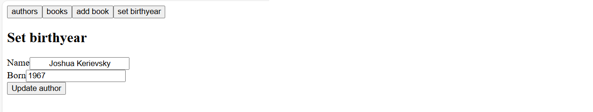

# Full Stack Open 2025 – Part 8: GraphQL Exercises

This repository contains my solutions for Part 8 of the Full Stack Open course. I implemented a GraphQL server using Apollo Server in the `library-backend.js` file.

## Files Included

- `library-backend.js` – the main backend file for the GraphQL server
- Screenshots for each exercise

---

## Exercises

### 8.1 – Creating a GraphQL server

### 8.2 – Query all books

### 8.3 – Query all authors

### 8.4 – Count of books and authors

### 8.5 – Filter books by genre

### 8.6 – Add a book mutation

### 8.7 – Add birth year to author

### 8.8 – Edit author mutation

### 8.9 – Apollo Client setup

### 8.10 – Use Apollo Client to fetch authors

### 8.11 – Display authors in a table

### 8.12 – Form to update author's birth year

