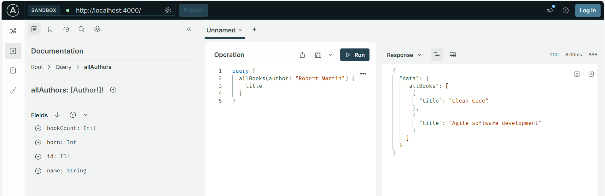
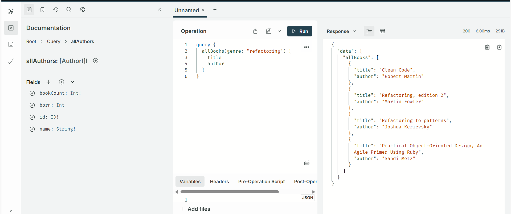

# Full Stack Open 2025 – Part 8: GraphQL Exercises (8.1–8.7)

This repository contains my solutions for Part 8 of the Full Stack Open course. I implemented a GraphQL server using Apollo Server in the `library-backend.js` file.

## Files Included

- `library-backend.js` – the main backend file for the GraphQL server
- Screenshots for each exercise (8.1 to 8.7)

---

## Exercises

### 8.1 – Creating a GraphQL server

### 8.2 – Query all books

### 8.3 – Query all authors

### 8.4 – Count of books and authors

### 8.5 – Filter books by genre

### 8.6 – Add a book mutation

### 8.7 – Add birth year to author

